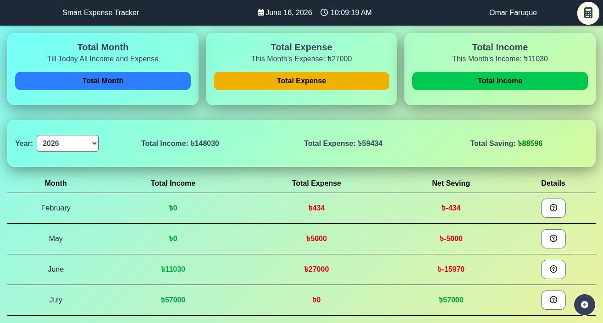
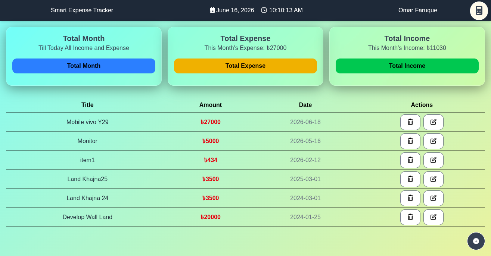
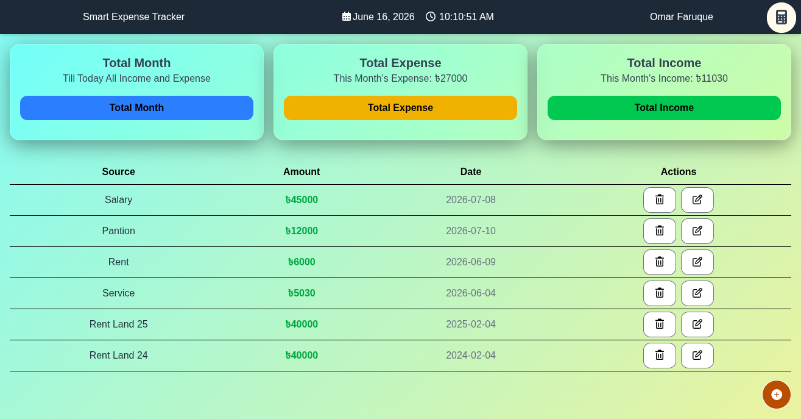
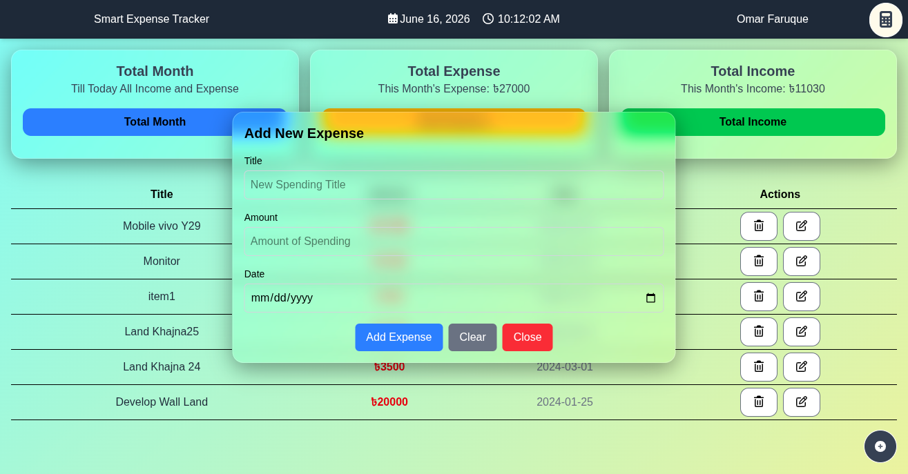
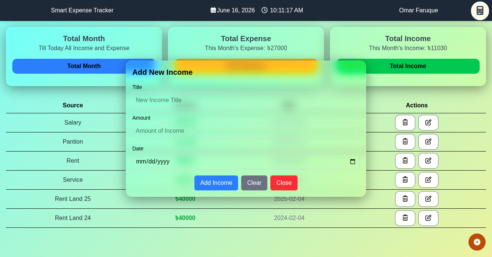
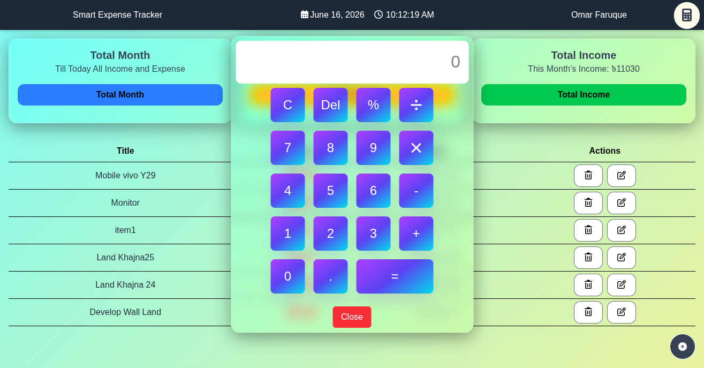
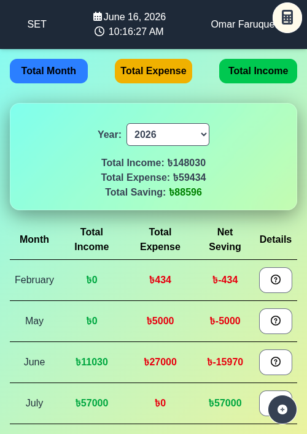

# 💰 Smart Wallet - Dynamic Income & Expense Tracker

**Smart Wallet** is a fully dynamic and professional personal finance tracking web application designed to help users seamlessly monitor and manage their daily incomes and expenses. This project combines complex vanilla JavaScript logic with a highly optimized, responsive CSS architecture.









## 🚀 Key Features

* **Dynamic Live Dashboard:** Real-time calculation and visual updates of Total Income, Total Expense, and Current Balance as data changes.
* **Dynamic Year Filter:** No hardcoded dropdown values! The application automatically scans the dataset using JavaScript (`Set()`), detects the unique years active in the logs, and populates the filter selection dynamically.
* **Targeted Report Filtering:** Selecting a year dynamically transforms the **Total Month** overview matrix and transaction modals without overriding or damaging the core comprehensive ledgers.
* **Deep Monthly Analysis & Modals:** Features granular breakdown summaries per month with an interactive question-button modal that displays detailed date-wise item entries for that specific month.
* **In-Built Toggle Calculator:** An expandable, scientific/standard floating calculator is built right into the UI for rapid ledger computations without leaving the application.
* **Pure CSS Responsive Architecture:** Leverages Tailwind CSS grids and display states (`hidden md:block` / `block md:hidden`) to handle absolute desktop-to-mobile UI switching seamlessly, completely discarding heavy window-resize scripts.
* **Persistent Local Storage:** Retains complete client data records across unexpected page refreshes, tab changes, and browser restarts.

## 🛠️ Tech Stack

* **Structure:** HTML5
* **Styling:** Tailwind CSS (Modern Utility Classes, Layout Grids & Custom Blur Cards)
* **Core Logic:** Vanilla JavaScript (ES6+, Advanced Array Methods, DOM Manipulation, LocalStorage)
* **Icons:** FontAwesome v6

## 📂 Project Structure

* `index.html` - Core markup containing structurally separated desktop and mobile responsive viewport panels.
* `script.js` - Central hub containing asynchronous-like data pipelines, math engines, calendar utilities, and application state.
* `style.css` & `output.css` - Custom glassmorphic styling filters combined with compiled production-ready Tailwind utilities.

## 🔧 Installation & Setup

1. Clone this repository to your local machine:
   ```bash
   git clone [https://github.com/myweb768/Smart-Expense-Tracker.git](https://github.com/myweb768/Smart-Expense-Tracker.git)